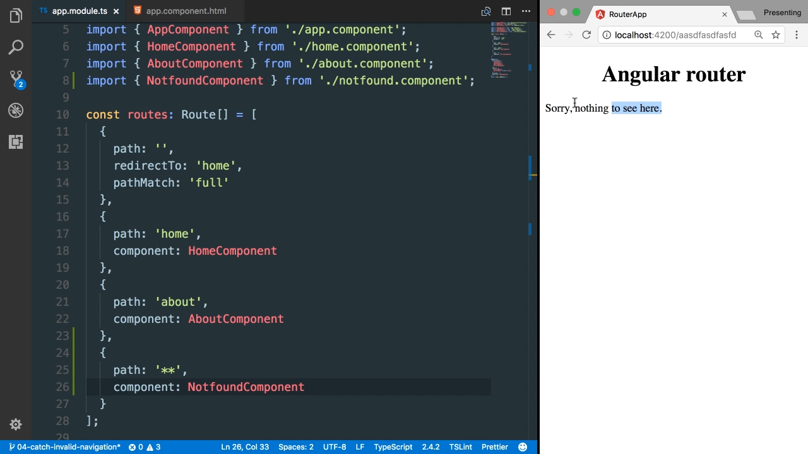

In the sample application, we have defined different kind of routes which we can navigate to by changing the URL up here. Now, what happens if the user types in some URL which doesn't exist? Our application redirects simply to the home, and nothing happens.

We want obviously to have a better user experience. Let's generate a new component. Let's call it `notfound`. 

#### console
```javascript
ng g component notfound --flt -it -is --spec=false
```

Then we go to our app module, and at the very end here, we define a route that is going to catch all those routes which aren't matched.

We do that by defining here 2 asterisk. 

#### app.module.ts
```javascript
const routes: Route[] = [
  {
    path: '',
    redirectTo: 'home',
    pathMatch: 'full'
  },
  {
    path: 'home',
    component: HomeComponent
  },
  {
    path: 'about',
    component: AboutComponent
  },
  {
    path: '**',
    component: NotfoundComponent
  }
];
```

As a component, as you can imagine, we specify our `NotFoundComponent`. Let's open the `NotFoundComponent`, specify here, "Sorry, nothing to see here." Great. Let's save this.

#### notfound.component.ts
```typescript
import { Component, OnInit } from '@angular/core';

@Component({
  selector: 'app-notfound',
  template: `<p>
                Sorry, nothing to see here
            </p>`,
  styles: []
})
export class NotfoundComponent implements OnInit {

  constructor() { }

  ngOnInit() {
  }

}
```

Now, whenever we go to our routing component here, our normal routes just work. Where we a specify a route which doesn't exist, our component here, `notfound`, gets loaded and displays something nice to the user.

