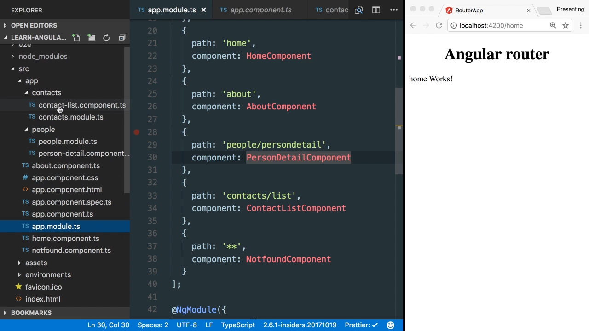

In our neat little application here, we have defined a couple of `routes` where you can see here defined in this array here. 

#### app.module.ts
```javascript
const routes = [
  {
    path: '',
    redirectTo: 'home',
    pathMatch: 'full'
  },
  {
    path: 'home',
    component: HomeComponent
  },
  {
    path: 'about',
    component: AboutComponent
  },
  {
      path: 'people/personedtail',
      component: PersonDetailComponent
  },
  {
      path: 'contacts/list',
      component: ContactListComponent
  },
  {
    path: '**',
    component: NotfoundComponent
  }
];
```
Those are being registered down here, and a `RouterModule.forRoute`, and app module.

What jumps to one's eye immediately is, when you look at a route configuration, we have here two components, one in the `people` module and one the `contact` module. Both components reside inside separate dedicated modules, which follow the normal pattern of how you structure Angular applications. 



They have their own ng module where it defined their components.

Similarly, we will also like to structure our routes. As you can imagine in a more complex application, this route definition here might get quite complex and quite huge, and turns into being very hard to maintain and to manage.

Therefore one suggestion which has to be taken for sure is to externalize this in its own file and manage it there, but anyways it will be much cleaner to further split those out into their own modules.

This is exactly what a routing module pattern suggests, which is one of the patterns that should be followed according to the official Angular documentation. Let's take a look how this works. Let's start with the people module here and let's similarly define a new file which we call people-routing.module.

This file is a normal ng module. We need to import the ng module from Angular core, and we define ng module section below here, and we also export it. We call it people routing module.

This follows our official style guide on angular.io. Next we need to define our routes, obviously. We can go back to the app module and copy out that person route which is defined inside here.

Let's remove it from here, for a second, jump back to our people routing module. Here we define our routes, which is an array which defines here our people component.

Obviously, we need to import that as well. Once we have that, we can then import the routing module, so import the router module from Angular router, and we can go down into the ng module section.

In the imports part, we basically declare the router module. At this time, we don't call for route, as we did in the global router path, but this time we define for child and we pass in the routes definitions. Last time, we also need to export the router module such as that can be then consumed by others.

Once we have defined the people routing module, we obviously also need to register it on its own people module. That happens directly in the import section. Here, we defined people routing module when we import it from where we have defined it.

We need to do exact thing also for the context part. Let me just quickly do that for you. Great. Once we have both modules here defined -- so the context routing module as well as the people routing module -- we can go back to our app module and do the very same thing also for the application itself.

We take out those definitions. We create its own file AppRoutingModule. Here, we need to import the very same things. Then, we can copy in here our route definitions.

We also need to obviously import their components to the home components here [inaudible] component, and the not-found component. All of them belonged to global app module, as you can see it get import directly from local directory.

Finally, we need to also register them. Here you have to pay attention, because now we have define obviously for route and pass in those routes definitions. Great. We have concluded most of the parts we need to define a jump back to our app module.

We can remove here parts like the contact list component and a people leader component, as we haven't really register down here, because they have their own registrations in their modules.

What we need to do here is to import AppRoutingModule, and finally we have to register all of them down here. The people module and the context module have already been registered. Here, we need to define AppRoutingModule as the last part.

The sequence here is very important. Each of these defines their own type of routing modules, which have to be defined before and at the very last comes to AppRoutingModule. Because as we know the routings are being processed by sequence, therefore moving around these could have some strange side effects.

If we save and refresh here the browser, we can see that the home route perfectly loads. We can then also go to the contacts list, and the contact list works and also the people, person detail works as we expect.
